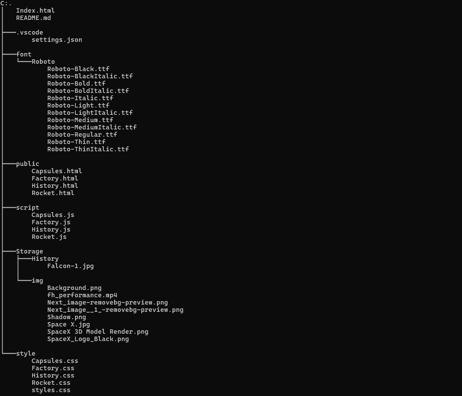

# PROYECTO-FILTRO_JS_LizarazoMar-a-CorreaJerxon

Realización del proyecto filtro usando herremientas como HTML y CSS para la maquetación visual. Y JavaScript para la lectura de las APIS y funcionamiento general de la página.

# Descripción

La página está basada en la empresa SpaceX dónde nos mostrará 4 páginas  diferentes aparte de la principal.

### Rockets:
Ésta nos mostrará toda la base de cohetes hallada en la API, tambien nos permite conocer las caracteristicas y funcionalidades de los cohetes.

### Company / Factory:
Nos muestra la empresa, una pequeña descripción y nos permite conocer datos básicos relevantes de ella, como lo son el CEO, la Presidente & COO, el CTO de Propulsión, el año en el que la empresa fué fundada y como extra, nos mostrará un carrete de imagenes en el cual podremos observar despegues y demás de los cohetes realizados por la empresa.

### History:
Nos permite observar las historias compartidas por la empresa, iniciado con el título, una pequeña descripción y datos básicos de los depegues (UNIX y UTC).

### Capsules:
Nos permite conocer aspectos únicos de cada capsula, como lo son:
* Su tipo.
* Si ya está retirada.
* Si aún sigue activa.

# Tecnologías Utilizadas

*HTML5
*CSS
*JavaScript

# Estructura del proyecto

Allí aparece todo el código y lo demás utilizado para realizar la maquetación y funcionalidad del proyecto filtro.

# Características

* Los archivos [.html]: son los que contienen el código por el cual podemos hacer los cambios estéticos y funcionales de la página.
* Los archivos [.css]: son los que permiten llevar acabo todo el responsive y diseño de la página.
* Los archivos [.js]: son los que nos permiten hacer una funcionalidad más amena y "sencilla" al momento de realizar la página.

# Diseño

* Se realizó un diseño responsive con el fin de que esta página pueda ser abierta por varios dispositivos.
* Su diseño fue realizado de la manera más secilla y apta para que aquel que la abra, pueda entender todo de una manera más fácil.

# Instrucciones
1. Clonar el repositorio cargado en git.
2. Abrir en la nube el primer archivo Index y seguir las instrucciones de la página.

# Desarrollado por.
Proyecto filtro realizado por María Guadalupe Lizarazo Leal y Jerxon Jair Correa Amaris, estudiantes de Campus-Lands.

